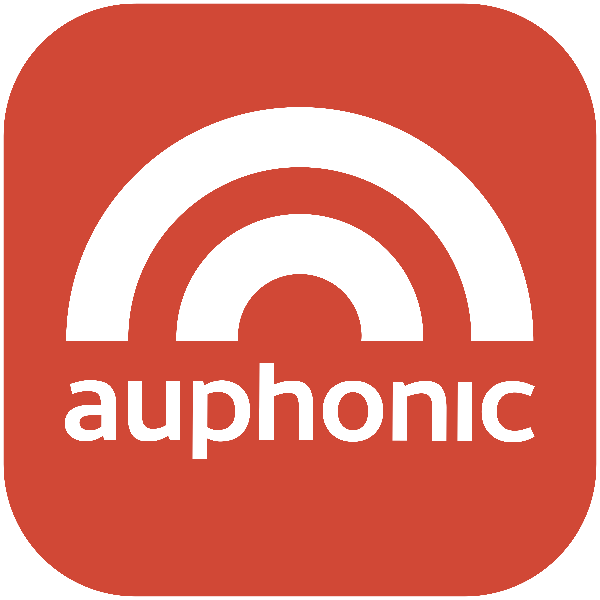

# Auphonic for Alfred
<h1 align="center">Auphonic for Alfred</h1>

  

<em><a href="https://youtu.be/2TWJGcTVy3A">~ How I use Auphonic (Video) ~</a></em>

Alfred workflow for seamlessly processing audio files through Auphonic's API. [Auphonic](https://auphonic.com?source=robper) is a professional audio post-production service that provides automated audio processing and optimization, including leveling, noise reduction, and encoding.

**This workflow streamlines the uploading/downloading of audio files for them to be processed using up to four of your Auphonic presets.**

---
## FEATURES

- Process single or multiple audio files
- Real-time notifications of processing status
- Automatic download of processed files to Downloads folder
- Error handling with automatic redirect to Auphonic production page

---
## HOW TO

1. Select one or more files in Finder and open Alfred's actions window
2. Search for "Process with Auphonic" to process your files

The workflow keeps you updated in two ways:
- System notifications showing processing status
- Status updates in Alfred's search bar using your custom keyword

**Using Different Presets:**
- No modifier: Uses default preset
- Command (⌘): Uses preset 1
- Option (⌥): Uses preset 2
- Control (⌃): Uses preset 3

**Quick Tip:** If the Alfred search bar shows that no files are being processed, press CMD to open the last saved Auphonic URL. This helps when there's an error or server issue. You can always access your productions directly on Auphonic's website as well.

---
## SUPPORTED FILE TYPES
**Currently, the following file types are supported for upload:**
- MP4
- MP3
- WAV
- AIFF

**The following file types are supported for auto-download**
- MP3
- WAV
- M4A
- MP4

Please make sure that your chosen preset includes the file type that you intend to download. If you need a different file type not listed here, let me know, and I'll be happy to add it—if possible.

---
*DISCLAIMER. Just a note letting you know that links in this README to Auphonic's site are affiliate ones, earning me a small commission if you ever decide to purchase processing credits through them, at no extra cost to you. I only recommend products I've personally vetted and believe are truly exceptional. Thanks for your support!*